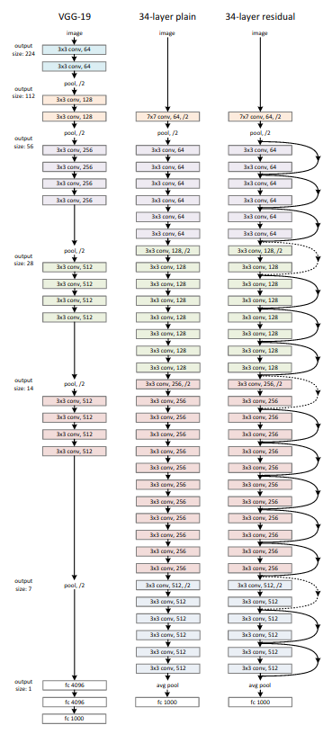

## Resnet - Pytorch

Implementation of <a href="https://arxiv.org/abs/1512.03385">ResNet</a> in Pytorch.

</img>

## Usage

Models can be initialized with pre-build or custom versions.

Pre-build models:

- ResNet18
- ResNet34
- ResNet50
- ResNet101
- ResNet152

Code example to initialize and use prebuild ResNet34

```python
import torch
from resnet_pytorch import build_resnet34

model = build_resnet34(num_classes=10, in_channels=3)

img = torch.randn(1, 3, 300, 300)  # <batch_size, in_channels, height, width>
preds = model(img)  # (1, 10) <batch_size, num_classes>
```

Code example to initialize ResNet34 using the custom ResNet

```python
import torch
from resnet_pytorch import ResNet, ResidualBlock

model = ResNet(
    in_channels=3,
    num_classes=10,
    num_layers=[3, 4, 6, 3],
    num_channels=[64, 128, 256, 512],
    block=ResidualBlock
)

img = torch.randn(1, 3, 300, 300)  # <batch_size, in_channels, height, width>
preds = model(img)  # (1, 10) <batch_size, num_classes>
```

### Parameters

- `in_channels`: int.  
The number of channels in the input image.


- `num_classes`: int.  
The number of predicted classes


- `num_layers`: List[int]  
The number of block layers in each stage.


- `num_channels`: List[int]  
The number of channels in each stage.  
Each stage will start with a stride of 2, connecting the previous stage channels 
with the current stage channels.


- `block`: Union[ResidualBlock, BottleneckBlock]  
The block type used.  
There are two pre-implemented block types: ResidualBlock and BottleneckBlock.  
Can be replaced with any custom block that has the following params in the constructor:
`in_channels`, `out_channels`, `stride`.
